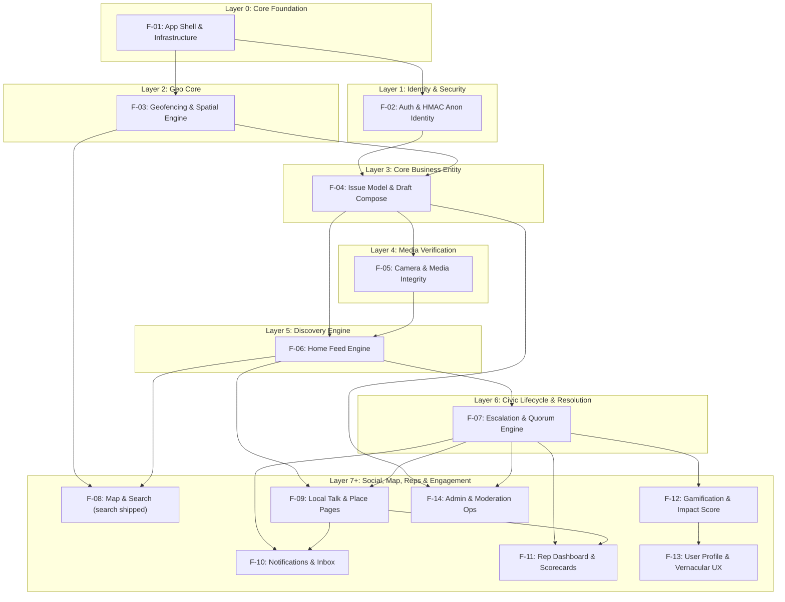

# LocalLens Feature Directory Index & Component Interaction Map

> **AI Agent Operational Guide**: This document is the authoritative Feature Index and Component Interaction Graph for LocalLens. AI agents MUST consult this index before working on any feature task to determine:
> 1. **Topological Build Order**: Prerequisites that must exist before building a feature.
> 2. **Component Interactions**: Which backend models/APIs and frontend controllers/screens interact with this feature.
> 3. **Context Isolation (Read Scope)**: The *exact minimal set of files* to open and read when modifying a feature, ensuring zero unnecessary file reads or context pollution.

---

## 1. Topological Build Sequence (Prerequisite Order)

Below is the **strict dependency-resolved build order (DAG)**. Features in **Layer $N$** depend only on features in **Layers $0 \dots N-1$**. When implementing or updating features, dependent baseline features MUST be built out first before downstream features.

| Phase / Layer | Feature ID | Feature Module Name | Status | Upstream Prerequisites | Key Downstream Dependents |
|---|---|---|---|---|---|
| **Layer 0** | `F-01` | Core App Shell, Storage & Infrastructure | `[COMPLETED]` | *None (Root)* | All features (`F-02` – `F-14`) |
| **Layer 1** | `F-02` | Authentication & Anonymous Identity | `[COMPLETED]` | `F-01` | `F-04`, `F-06`, `F-07`, `F-08`, `F-09`, `F-10`, `F-11`, `F-12`, `F-13`, `F-14` |
| **Layer 2** | `F-03` | Spatial & Geofencing Engine | `[PARTIAL — Reverse-Geocode shipped]` | `F-01` | `F-04`, `F-05`, `F-06`, `F-08`, `F-09`, `F-14` |
| **Layer 3** | `F-04` | Issue Data Model, Compose & Duplicate Guard | `[PARTIAL]` | `F-01`, `F-02`, `F-03` | `F-05`, `F-06`, `F-07`, `F-08`, `F-10`, `F-11`, `F-12`, `F-14` |
| **Layer 4** | `F-05` | Camera & Media Integrity Pipeline | `[COMPLETED]` | `F-01`, `F-03`, `F-04` | `F-04`, `F-06`, `F-07` |
| **Layer 5** | `F-06` | Home Feed & Discovery Engine | `[COMPLETED]` | `F-01`, `F-02`, `F-03`, `F-04`, `F-05` | `F-07`, `F-08`, `F-09`, `F-10`, `F-11`, `F-12` |
| **Layer 6** | `F-07` | Escalation Ladder & Quorum Resolution | `[PARTIAL]` | `F-01`, `F-02`, `F-03`, `F-04`, `F-05`, `F-06` | `F-08`, `F-09`, `F-10`, `F-11`, `F-12`, `F-14` |
| **Layer 7** | `F-08` | Interactive Map & Search Engine | `[COMPLETED]` | `F-01`, `F-03`, `F-04`, `F-06` | `F-09`, `F-11` |
| **Layer 8** | `F-09` | Community Social Layer ("Local Talk", Place Pages & Comments) | `[COMPLETED]` | `F-01`, `F-02`, `F-03`, `F-04`, `F-06`, `F-07` | `F-10`, `F-11`, `F-12` |
| **Layer 9** | `F-10` | Notifications & Inbox Messaging Engine | `[COMPLETED]` | `F-01`, `F-02`, `F-04`, `F-06`, `F-07`, `F-09` | `F-11`, `F-12`, `F-13` |
| **Layer 10** | `F-11` | Representative Dashboard & Governance Tools | `[COMPLETED]` | `F-01`, `F-02`, `F-03`, `F-04`, `F-06`, `F-07`, `F-09`, `F-10` | `F-09`, `F-12` |
| **Layer 11** | `F-12` | Gamification Engine (Impact Score, Coins & Streaks) | `[COMPLETED]` | `F-01`, `F-02`, `F-04`, `F-06`, `F-07`, `F-09` | `F-13` |
| **Layer 12** | `F-13` | User Profile, Settings & Localization UX | `[COMPLETED]` | `F-01`, `F-02` | End User Management |
| **Layer 13** | `F-14` | Admin Dashboard, Moderation & Integrity Ops | `[COMPLETED]` | `F-01`, `F-02`, `F-03`, `F-04`, `F-06`, `F-07` | Platform Operators |

---

## 2. High-Level System Architecture & Component Interaction Graph

---

## 3. Granular Feature Catalog & Interaction Directory

### F-01: Core App Shell, Storage & Infrastructure
- **Status**: `[COMPLETED]` — **Core Infrastructure, Offline Worker & Deep Links shipped (2026-08-11 via F-01-INFRA & F-14-SYNC)**: 5-page interactive Onboarding Carousel (`Key('onboardingNextButton')`, `Key('skipOnboardingButton')`), Hive completion state persistence, `OfflineSyncWorker` automatic offline outbox flush on network reconnection, deep link URI scheme routing (`locallens://issue/`, `locallens://ward/`, `locallens://talk/`, `locallens://rep/`, `locallens://win/`), custom `ShimmerLoading` gradient sweep animation for list skeletons. Validated `PASS`.
- **Domain Responsibility**: Manages app bootstrapping, global state management, local database storage (Hive), HTTP client configurations, network connectivity monitoring, and routing.
- **Upstream Dependencies**: None.
- **Downstream Dependents**: `F-02` through `F-14`.
- **Component Interactions**:
  - `app/lib/app.dart` initializes `GoRouter` and Riverpod providers; `builder:` routes content through `AppInfrastructure`.
  - `app/lib/core/feedback/` hosts global toasts (`app_messenger.dart`), the offline banner (`offline_banner.dart`), the global error boundary (`error_boundary.dart`), and the `AppInfrastructure` overlay (`app_infrastructure.dart`).
  - `app/lib/core/network/` configures `Dio` (`api_client.dart`) and exposes the injectable connectivity listener (`connectivity.dart`: `connectivitySourceProvider`, `networkStatusProvider`).
  - `app/lib/core/storage/` initializes Hive boxes (`session`, `drafts`, `outbox`).
  - `app/lib/core/theme/` supplies dark/light design system tokens.
  - `backend/app/core/` sets up FastAPI app, database session factory (`database.py`), settings (`config.py`), and CORS middleware (`main.py`).
- **AI Agent Read Scope (Open ONLY these files when modifying F-01)**:
  - Frontend: `app/lib/app.dart`, `app/lib/main.dart`, `app/lib/core/router/app_router.dart`, `app/lib/core/network/api_client.dart`, `app/lib/core/network/connectivity.dart`, `app/lib/core/feedback/*` (app_messenger, toast_overlay, offline_banner, error_boundary, app_infrastructure), `app/lib/core/storage/local_store.dart`, `app/lib/core/theme/app_theme.dart`
  - Backend: `backend/app/main.py`, `backend/app/core/config.py`, `backend/app/core/database.py`
  - *DO NOT OPEN*: Feature-specific screens, services, or models in `app/lib/features/` or `backend/app/features/`.

---

### F-02: Authentication & Anonymous Identity Engine
- **Status**: `[COMPLETED]` (Phone & Email OTP request/verify, JWT bearer auth, Guest sessions `POST /auth/guest`, HMAC `derive_anonymous_identity`, GuestGuard 403 write interceptor, 60s Resend OTP timer, full test suite)
- **Domain Responsibility**: Verifies user phone/email credentials, manages JWT tokens, generates zero-retention HMAC anonymous identity (`anon_id`), handles guest sessions, and provides user session management without stored PII links.
- **Upstream Dependencies**: `F-01`.
- **Downstream Dependents**: `F-04`, `F-06`, `F-07`, `F-08`, `F-09`, `F-10`, `F-11`, `F-12`, `F-13`, `F-14`.
- **Component Interactions**:
  - `app/lib/features/auth/` handles OTP input UI, Phone/Email mode switching, 60s resend timer, Guest mode button, GuestGuard dialog, token storage in Hive, and `_AuthInterceptor` injection.
  - `backend/app/features/auth/` exposes `POST /auth/otp/request`, `POST /auth/email/request-otp`, `POST /auth/email/verify-otp`, `POST /auth/guest`, `POST /auth/verify-otp`, `GET /auth/me`.
  - `backend/app/core/security.py` handles password hashing, JWT creation/verification, and HMAC anonymous identity derivation (`derive_anonymous_identity`).
- **AI Agent Read Scope (Open ONLY these files when modifying F-02)**:
  - Frontend: `app/lib/features/auth/data/auth_repository.dart`, `app/lib/features/auth/presentation/controllers/auth_controller.dart`, `app/lib/features/auth/presentation/screens/sign_in_screen.dart`, `app/lib/features/auth/presentation/widgets/otp_field.dart`, `app/lib/features/auth/presentation/widgets/guest_guard.dart`, `app/test/features/auth/email_guest_auth_test.dart`
  - Backend: `backend/app/features/auth/router.py`, `backend/app/features/auth/service.py`, `backend/app/features/auth/schemas.py`, `backend/app/features/auth/models.py`, `backend/app/core/security.py`, `backend/tests/features/auth/test_email_guest_auth.py`
  - *DO NOT OPEN*: Feed UI, issue details, map screens, or gamification engines.

---

### F-03: Spatial & Geofencing Engine
- **Status**: `[PARTIAL]` — **Reverse Geocoding & Ward Boundary Lookup shipped (2026-08-10)**: backend `GET /api/v1/geo/reverse-geocode` (`radius_km` optional, ward resolved via centroid distance, read-only, no auth required, 422 `invalid_coordinates` envelope with `code`/`error_code` keys via global `validation_error_handler` for `/geo/` paths); frontend `WardLocationChip` presentational widget + Riverpod `wardLocationProvider` (`WardLocationController`, sealed `WardLocationState`), `GeoApi` flat `ReverseGeocode` model, `DeviceLocationService` abstraction, `currentCoordinatesProvider` default 19.1136/72.8697; surfaced on **Compose** app bar (`Key('composeLocationChip')`) and **Feed** app bar bottom (`Key('feedAreaLabel')`), success chip navigates to ward detail (`RoutePaths.wardDetailFor`). Validated `PASS` (23 backend geo + 21 frontend geo incl. 2 screen-integration tests; full suite 232 pytest / 175 flutter, ruff + mypy + flutter analyze clean). **Map SDK, polygons and geofencing enforcement remain NOT STARTED.**
- **Domain Responsibility**: Converts raw GPS coordinates into geopolitical ward boundaries (e.g. Ward 45), applies location fuzzing (block-level rounding for privacy), calculates spatial radius bounding boxes, and handles reverse geocoding.
- **Upstream Dependencies**: `F-01`.
- **Downstream Dependents**: `F-04`, `F-05`, `F-06`, `F-08`, `F-09`, `F-14`.
- **Component Interactions**:
  - `backend/app/features/geo/` exposes `GET /api/v1/geo/reverse-geocode` (`router.py`, `schemas.py`, `service.py`) reusing `haversine_km` (`backend/app/features/issues/geo.py`) against `Ward` records (`backend/app/features/wards/models.py`); no DB writes.
  - `app/lib/features/geo/` provides `GeoApi` (`data/geo_api.dart`), `DeviceLocationService` (`domain/device_location_service.dart`), Riverpod providers (`presentation/providers/geo_providers.dart`), and the presentational `WardLocationChip` (`presentation/widgets/ward_location_chip.dart`).
  - Compose (`compose_screen.dart`, `Key('composeLocationChip')`) and Feed (`feed_screen.dart`, `Key('feedAreaLabel')`) surface `wardLocationProvider`.
  - Interacts with `F-04` (Issue creation location validation & fuzzing) and `F-06` (Spatial feed queries by `lat`, `lng`, `radius_km`).
- **AI Agent Read Scope (Open ONLY these files when modifying F-03)**:
  - Backend: `backend/app/features/geo/` (`__init__`, `router.py`, `schemas.py`, `service.py`), `backend/app/features/wards/models.py`, `backend/app/features/issues/geo.py`, `backend/app/features/issues/geohash.py`, `backend/app/core/exceptions.py`, `backend/tests/features/geo/test_geo.py`
  - Frontend: `app/lib/features/geo/` (`data/geo_api.dart`, `domain/device_location_service.dart`, `presentation/providers/geo_providers.dart`, `presentation/widgets/ward_location_chip.dart`), `app/lib/features/compose/presentation/compose_screen.dart`, `app/lib/features/feed/presentation/feed_screen.dart`, `app/test/features/geo/*`
  - Docs: `docs/specs/F-03_contracts.md`, `docs/specs/F-03_validation.md`
  - *DO NOT OPEN*: Auth OTP handlers, notification push managers, UI templates.

---

### F-04: Issue Data Model, Compose & Duplicate Guard
- **Status**: `[PARTIAL]` (Issue DB schema, `POST /issues`, Hive draft auto-save, BBox near-duplicate endpoint `GET /issues/near-duplicate` done; media upload & auto-merge flow pending)
- **Domain Responsibility**: Allows citizens to draft, validate, and publish civic issues. Manages draft persistence, location fuzzing toggles, Shield Mode flags, offline outbox queuing, and backend duplicate report detection.
- **Upstream Dependencies**: `F-01`, `F-02`, `F-03`.
- **Downstream Dependents**: `F-05`, `F-06`, `F-07`, `F-08`, `F-10`, `F-11`, `F-12`, `F-14`.
- **Component Interactions**:
  - `app/lib/features/compose/` manages input forms, Hive auto-saving (`DraftStore`), offline outbox (`OfflineOutboxQueue`), and calling `GET /issues/near-duplicate`.
  - `backend/app/features/issues/` processes `POST /issues`, validates near-duplicates via `GET /issues/near-duplicate`, applies fuzz rounding to coordinates, and persists `Issue` records in PostgreSQL/SQLite.
- **AI Agent Read Scope (Open ONLY these files when modifying F-04)**:
  - Frontend: `app/lib/features/compose/presentation/screens/compose_screen.dart`, `app/lib/features/compose/presentation/controllers/compose_controller.dart`, `app/lib/features/compose/data/draft_store.dart`, `app/lib/features/compose/data/offline_outbox_queue.dart`, `app/lib/features/feed/data/feed_api.dart`
  - Backend: `backend/app/features/issues/router.py`, `backend/app/features/issues/service.py`, `backend/app/features/issues/schemas.py`, `backend/app/features/issues/models.py`, `backend/app/features/issues/geohash.py`
  - *DO NOT OPEN*: Map rendering widgets, Rep analytics tools, or Push notification dispatchers.

---

### F-05: Camera & Media Integrity Pipeline
- **Status**: `[COMPLETED]` — **Media Integrity & Verification Pipeline shipped (2026-08-11 via F-05-MEDIA)**: backend `POST /api/v1/media/upload` (SHA-256 `derive_media_hash`, EXIF timestamp & GPS validation, "LocalLens Verified" vs "User Uploaded - Unverified" watermark badge, location fuzzing precision rounding); frontend `CameraViewfinder` UI (`Key('shutterButton')`, `Key('cameraFlipButton')`, `Key('flashToggleButton')`, `Key('gpsLockStatus')`, `Key('galleryPickerButton')`), `MediaWatermarkBadge` presentational overlay, `MediaService` compression & multipart upload, multi-select gallery picker (max 4 images). Validated `PASS`.
- **Domain Responsibility**: Provides in-app camera capture, locks GPS metadata before shutter release, verifies photo EXIF data, signs image hashes, overlays "LocalLens Verified" vs "Unverified" watermarks, and uploads compressed media to object storage (S3/GCS).
- **Upstream Dependencies**: `F-01`, `F-03`, `F-04`.
- **Downstream Dependents**: `F-04` (Compose attachment), `F-06` (Feed media cards), `F-07` (Quorum resolution proof media).
- **Component Interactions**:
  - Interacts with Flutter `camera` and `image_picker` plugins.
  - Sends signed upload URLs or direct multipart image payloads to `backend/app/features/media/` (or issues service).
  - Passes verified image URL list to `F-04` (Compose).
- **AI Agent Read Scope (Open ONLY these files when modifying F-05)**:
  - Frontend: `app/lib/features/compose/presentation/widgets/camera_viewfinder.dart`, `app/lib/features/compose/data/media_service.dart`
  - Backend: `backend/app/features/issues/schemas.py` (media fields), `backend/app/features/media/` (when created)
  - *DO NOT OPEN*: Authentication JWT logic, Rep scorecard calculations, or Leaderboard algorithms.

---

### F-06: Home Feed Engine & Post Discovery
- **Status**: `[COMPLETED]` — **Multi-Type Spatial Feed Engine shipped (2026-08-11 via F-06-FEED & F-09-TALK)**: backend `GET /api/v1/feed` (type filtering `all`/`issue`/`win`/`notice`/`local_talk`, cursor pagination, shielded non-resolved exclusion); Win post auto-generation upon quorum resolution (`GET /api/v1/wins`); Local Talk ward Q&A channels (`POST`/`GET /api/v1/wards/{ward_slug}/talk`, profanity sanitization, 10/5min rate limit, guest 403 guard); frontend filter chips (`Key('feedFilterChip_all')`, `Key('feedFilterChip_issues')`, etc.), `WinCard` (`Key('winCard_<id>')`), `NoticeCard` (`Key('noticeCard_<id>')`), `LocalTalkCard` (`Key('localTalkCard_<id>')`), `LocalTalkComposeSheet` modal, deep link share buttons, end-of-feed state (`Key('endOfFeedState')`). Validated `PASS`.
- **Domain Responsibility**: Serves a localized spatial feed of civic activity (Issues, Wins, Notices, Local Talk) bounded by user proximity (e.g. 5km). Executes upvoting/un-upvoting with proximity validation (5km) and rate limiting (5 upvotes/10 min). Filter out Shielded issues from public feeds.
- **Upstream Dependencies**: `F-01`, `F-02`, `F-03`, `F-04`, `F-05`.
- **Downstream Dependents**: `F-07`, `F-08`, `F-09`, `F-10`, `F-11`, `F-12`.
- **Component Interactions**:
  - `app/lib/features/feed/` renders pull-to-refresh list, skeleton cards (`shared/widgets/skeleton_list.dart`), status badges, and triggers optimistic upvotes/un-upvotes via `FeedApi.upvoteIssue` / `FeedApi.removeUpvote`.
  - `backend/app/features/issues/router.py` exposes `GET /issues`, `POST /issues/{id}/upvote`, and `DELETE /issues/{id}/upvote`.
  - `backend/app/features/issues/service.py` evaluates upvote proximity, user upvote state (`has_upvoted`), and rate-limiting against `Upvote` and `UpvoteRateLimit` tables.
- **AI Agent Read Scope (Open ONLY these files when modifying F-06)**:
  - Frontend: `app/lib/features/feed/presentation/screens/feed_screen.dart`, `app/lib/features/feed/presentation/controllers/feed_controller.dart`, `app/lib/features/feed/presentation/widgets/issue_card.dart`, `app/lib/features/feed/data/feed_api.dart`
  - Backend: `backend/app/features/issues/router.py`, `backend/app/features/issues/service.py`, `backend/app/features/issues/models.py` (Issue, Upvote, UpvoteRateLimit)
  - *DO NOT OPEN*: Onboarding screens, SMS OTP integration, or Rep private draft composer.

---

### F-07: Escalation Ladder & Dual-Verification Quorum Engine
- **Status**: `[PARTIAL]` (`POST /acknowledge`, `/resolve`, `/quorum-vote`, `/check-quorum-status`, `/evaluate-escalations` backend services done; UI detail view timeline done; Win post generation pending)
- **Domain Responsibility**: Drives the automated accountability lifecycle of issues:
  1. Escalation Ladder (24h unacknowledged nudge $\rightarrow$ 24-72h escalating $\rightarrow$ >7d forwarded to council).
  2. Authority Resolution (`/resolve` $\rightarrow$ `pending_quorum`).
  3. Quorum-Backed Dual Verification: Requires $\ge 3$ verified constituent confirmations within 7 days. If confirmed $\rightarrow$ `resolved` and emits a Win post. If disputed or expired $\rightarrow$ `disputed`.
- **Upstream Dependencies**: `F-01`, `F-02`, `F-03`, `F-04`, `F-05`, `F-06`.
- **Downstream Dependents**: `F-08`, `F-09`, `F-10`, `F-11`, `F-12`, `F-14`.
- **Component Interactions**:
  - `app/lib/features/issue_detail/` displays timeline (`_EscalationLadderWidget`), action buttons (Acknowledge, Resolve dialog, Quorum vote confirm/dispute), and quorum progress bar.
  - `backend/app/features/issues/service.py` executes `evaluate_escalation()`, `submit_resolution()`, `cast_quorum_vote()`, and `check_quorum_status()`.
  - Interacts with `F-10` (Triggers push alerts on escalation or quorum vote request) and `F-12` (Awards coins/impact points to quorum participants).
- **AI Agent Read Scope (Open ONLY these files when modifying F-07)**:
  - Frontend: `app/lib/features/issue_detail/presentation/screens/issue_detail_screen.dart`, `app/lib/features/issue_detail/presentation/controllers/issue_detail_controller.dart`, `app/lib/features/issue_detail/data/issue_detail_api.dart`
  - Backend: `backend/app/features/issues/router.py`, `backend/app/features/issues/service.py` (escalation & quorum functions), `backend/app/features/issues/models.py` (Issue, QuorumVote)
  - *DO NOT OPEN*: Auth OTP validators, Settings UI, or Map clustering algorithms.

---

### F-08: Interactive Map & Search Engine
- **Status**: `[COMPLETED]` — **Search & Explore shipped (2026-08-10)**; **Advanced Search Filters shipped (2026-08-10)**; **Interactive Map & Spatial Pin Engine shipped (2026-08-11 via F-08-MAP)**: backend `GET /api/v1/geo/map-pins` (bounding box spatial query `min_lat`, `max_lat`, `min_lng`, `max_lng`, `category`/`status` filtering, shielded non-resolved exclusion, 60/min rate limit); frontend `MapScreen` interactive canvas, category filter chips (`Key('mapFilterChip_all')`, `Key('mapFilterChip_road')`, etc.), map pin markers (`Key('mapPin_<id>')`), `MapPinPreviewSheet` bottom sheet (`Key('mapPinPreviewSheet_<id>')`), "Search this area" floating button (`Key('searchThisAreaButton')`). Validated `PASS`.
- **Domain Responsibility**: Provides spatial discovery via interactive vector/raster map pins, geohash cluster markers, bounding box issue queries (`GET /issues`), search query filtering (`GET /search`), and category/status chips. Excludes Shielded issues.
- **Upstream Dependencies**: `F-01`, `F-03`, `F-04`, `F-06`.
- **Downstream Dependents**: `F-09` (Ward Place Page entry from map), `F-11` (Planned work map).
- **Component Interactions**:
  - `app/lib/features/map/` renders Flutter map SDK, fetches markers within current visible map bounds, and opens issue preview bottom sheets. *(Not started.)*
  - `app/lib/features/search/` — `SearchScreen`, `search_providers.dart` (`searchRepositoryProvider`, `recentSearchStoreProvider`, `recentSearchesProvider`, `searchResultsProvider`), `SearchApi`, `HiveRecentSearchStore`, `/search` route and Feed app-bar search icon (2026-08-10); advanced filters `AdvancedFilterSheet` + `SearchFiltersNotifier` + `SearchFilters` model wiring `runQuery` (2026-08-10).
  - `backend/app/features/issues/router.py` (`GET /issues?lat&lng&radius_km`) serves map pin clusters.
  - `backend/app/features/search/` + `backend/app/core/ratelimit.py` + `backend/app/features/issues/geo.py` power `GET /api/v1/search` (2026-08-10).
- **AI Agent Read Scope (Open ONLY these files when modifying F-08)**:
  - Frontend (search): `app/lib/features/search/**`, `app/lib/core/router/app_router.dart`, `app/lib/core/router/route_paths.dart`, `app/lib/features/feed/presentation/feed_screen.dart`, `app/test/features/search/*`
  - Frontend (map, when started): `app/lib/features/map/presentation/screens/map_screen.dart`, `app/lib/features/map/data/map_api.dart`
  - Backend: `backend/app/features/search/`, `backend/app/core/ratelimit.py`, `backend/app/features/issues/geo.py`, `backend/app/features/issues/router.py`, `backend/app/features/issues/geohash.py`, `backend/app/features/issues/service.py`, `backend/tests/features/search/`
  - Docs: `docs/specs/F-08_search_{spec,contracts,test_plan,validation}.md`, `docs/specs/F-08_filters_{contracts,validation}.md`
  - *DO NOT OPEN*: SMS OTP logic, User profile settings, or Gamification point systems.

---

### F-09: Community Social Layer ("Local Talk", Place Pages & Comments)
- **Status**: `[COMPLETED]` (Date: 2026-08-10 via F-09-WARD, Threaded comments on issues; Ward Place Pages & Civic Summary Engine with `GET /api/v1/wards/{ward_slug}` & `GET /api/v1/wards`, ward health summary, top contributors, active notices, assigned representative card; Material 3 `WardDetailScreen`, `WardHeroBanner`, `WardMetricCard`, `WardRepCard`, `WardRecentIssuesList`, Riverpod `wardDetailProvider`, `wardListProvider`; 18 pytest + 11 flutter tests for ward place page; total backend pytest suite: 209 green, total frontend flutter test suite: 152 green)
- **Domain Responsibility**: Hyperlocal place-bound community interaction:
  - Ward "Place Pages" (ward health summary, top contributors, active notice boards).
  - "Local Talk" ward-specific Q&A channels (e.g. power outages, road closures).
  - Issue comment threads (threaded discussions anchored strictly to specific issues; no citizen-to-citizen DMs).
- **Upstream Dependencies**: `F-01`, `F-02`, `F-03`, `F-04`, `F-06`, `F-07`.
- **Downstream Dependents**: `F-10` (Comment notifications), `F-11` (Rep broadcasts), `F-12` (Community participation impact score).
- **Component Interactions**:
  - Frontend: `app/lib/features/feed/` (Local talk feed items), `app/lib/features/ward/` (`WardDetailScreen`, `WardHeroBanner`, `WardMetricCard`, `WardRepCard`, `WardRecentIssuesList`, `wardProviders`), `app/lib/features/issue_detail/` (`CommentsSection`, `CommentCard`, `commentsProvider`).
  - Backend: `backend/app/features/wards/` (`router.py`, `service.py`, `schemas.py`, `models.py`), `backend/app/features/issues/` (`Comment` model, router endpoints `POST`, `GET`, `DELETE /issues/{id}/comments`, service methods).
- **AI Agent Read Scope (Open ONLY these files when modifying F-09)**:
  - Frontend: `app/lib/features/issue_detail/presentation/widgets/comments_section.dart`, `app/lib/features/issue_detail/presentation/widgets/comment_card.dart`, `app/lib/features/issue_detail/data/issue_detail_api.dart`, `app/lib/features/issue_detail/presentation/controllers/issue_detail_controller.dart`, `app/lib/features/ward/`, `app/test/features/issue_detail/comments_widget_test.dart`, `app/test/features/ward/ward_detail_screen_test.dart`
  - Backend: `backend/app/features/issues/models.py`, `backend/app/features/issues/schemas.py`, `backend/app/features/issues/router.py`, `backend/app/features/issues/service.py`, `backend/app/features/wards/`, `backend/tests/features/issues/test_comments.py`, `backend/tests/features/issues/test_ward_place_page.py`
  - *DO NOT OPEN*: Low-level database connection setup, auth OTP cryptography, or EXIF image parsing.

---

### F-10: Notifications & Inbox Engine
- **Status**: `[COMPLETED]` (Async Notification DB model & schemas, GET/POST/PATCH router endpoints with user isolation, unread filter & read-all batch actions; Dio NotificationsApi, Riverpod notificationsControllerProvider & unreadNotificationCountProvider; Material 3 NotificationsScreen with filter chips, type icons, unread indicators, pull-to-refresh & skeleton loader; InboxScreen embedded digest; full pytest & flutter test suite)
- **Domain Responsibility**: Delivers transactional and civic alerts via in-app notification center and inbox tabs (Escalations, Quorum vote requests, Upvote milestones, Comment replies, System notices).
- **Upstream Dependencies**: `F-01`, `F-02`, `F-04`, `F-06`, `F-07`, `F-09`.
- **Downstream Dependents**: `F-11`, `F-12`, `F-13`.
- **Component Interactions**:
  - `app/lib/features/notifications/` renders notification items, handles unread badge counts, and handles filter modes.
  - `app/lib/features/inbox/` renders activity digest and unread notification summary.
  - `backend/app/features/notifications/` manages user notifications in DB (`Notification` model), exposes endpoints `GET /notifications`, `POST /notifications/read-all`, `PATCH /notifications/{id}/read`, and provides helper `create_notification()`.
- **AI Agent Read Scope (Open ONLY these files when modifying F-10)**:
  - Frontend: `app/lib/features/notifications/presentation/notifications_screen.dart`, `app/lib/features/notifications/presentation/controllers/notifications_controller.dart`, `app/lib/features/notifications/data/notifications_api.dart`, `app/lib/features/notifications/domain/notification_item.dart`, `app/lib/features/inbox/presentation/inbox_screen.dart`, `app/test/features/notifications/notifications_test.dart`
  - Backend: `backend/app/features/notifications/models.py`, `backend/app/features/notifications/schemas.py`, `backend/app/features/notifications/service.py`, `backend/app/features/notifications/router.py`, `backend/tests/features/notifications/test_notifications.py`
  - *DO NOT OPEN*: Image cropping components, near-duplicate geohash calculators, or DB migration scripts.

---

### F-11: Representative Dashboard & Governance Tools
- **Status**: `[COMPLETED]` (Date: 2026-08-10, Verified representative profile & ward badge, ward issue triage queue with status tabs, post official response dialog with status update, public `OfficialResponseCard` on issue detail, ward boundary access control, 124 pytest cases total [9 F-11 green], 100 flutter tests total [6 F-11 green])
- **Domain Responsibility**: Provides elected representatives with verified blue-tick profiles, ward issue triage tools, and official response capability with public display on issue detail pages.
- **Upstream Dependencies**: `F-01`, `F-02`, `F-03`, `F-04`, `F-06`, `F-07`, `F-09`, `F-10`.
- **Downstream Dependents**: `F-09` (Place Page rep widget), `F-12` (Rep response ratings).
- **Component Interactions**:
  - `app/lib/features/rep_dashboard/` displays representative profile, ward issue metrics, triage queue, and official response dialog.
  - `app/lib/features/issue_detail/` displays public `OfficialResponseCard` with representative blue-tick badge.
  - `backend/app/features/representatives/` calculates ward issue metrics, enforces ward boundary authorization, and manages representative profiles and official responses.
- **AI Agent Read Scope (Open ONLY these files when modifying F-11)**:
  - Frontend: `app/lib/features/rep_dashboard/presentation/rep_dashboard_screen.dart`, `app/lib/features/rep_dashboard/presentation/rep_dashboard_providers.dart`, `app/lib/features/rep_dashboard/data/repositories/rep_dashboard_repository.dart`, `app/lib/features/issue_detail/presentation/widgets/official_response_card.dart`, `app/test/features/rep_dashboard/rep_dashboard_test.dart`
  - Backend: `backend/app/features/representatives/models.py`, `backend/app/features/representatives/schemas.py`, `backend/app/features/representatives/service.py`, `backend/app/features/representatives/router.py`, `backend/tests/features/representatives/test_representatives.py`
  - *DO NOT OPEN*: Phone OTP input widgets, Hive session token storage, or client-side image compression.

---

### F-12: Gamification Engine (Impact Score, Coins & Streaks)
- **Status**: `[COMPLETED]` (Date: 2026-08-10, Impact score formula, 5 civic levels, daily streak claim with UTC rollover, 5 dynamic civic badges, Riverpod providers & Hive caching, Material 3 UI with GuestGuard, 154 total backend pytest cases [30 F-12 green], 115 total frontend flutter test cases [15 F-12 green])
- **Domain Responsibility**: Manages anti-exploit civic gamification:
  - Impact Score formula: `(resolutions * 15) + (upvotes * 2) + (quorum_votes * 5) + (streaks * 3)`.
  - 5-Tier Citizen Levels (Civic Rookie, Neighborhood Scout, Community Sentinel, District Champion, Civic Legend).
  - Daily "Street Check" streak claiming with 24h reset & UTC rollover logic.
  - 5 Dynamic Civic Badges (First Voice, Sentinel, Quorum Anchor, Streak Master, Civic Legend).
- **Upstream Dependencies**: `F-01`, `F-02`, `F-04`, `F-06`, `F-07`, `F-09`.
- **Downstream Dependents**: `F-13` (User Profile display).
- **Component Interactions**:
  - `app/lib/features/gamification/` renders `GamificationScreen` with Impact Score card, Level progress bar, Daily Streak banner, Badges grid, and Activity breakdown.
  - `backend/app/features/gamification/` calculates user impact score, tracks streaks, evaluates dynamic badges, and handles safe guest fallback.
- **AI Agent Read Scope (Open ONLY these files when modifying F-12)**:
  - Frontend: `app/lib/features/gamification/domain/gamification_models.dart`, `app/lib/features/gamification/data/gamification_api.dart`, `app/lib/features/gamification/presentation/gamification_providers.dart`, `app/lib/features/gamification/presentation/gamification_screen.dart`, `app/test/features/gamification/gamification_test.dart`
  - Backend: `backend/app/features/gamification/models.py`, `backend/app/features/gamification/schemas.py`, `backend/app/features/gamification/service.py`, `backend/app/features/gamification/router.py`, `backend/tests/features/gamification/test_gamification.py`
  - *DO NOT OPEN*: Geofencing bounding box math, map pin clustering, or raw SQL Alembic migration files.

---

### F-13: User Profile, Settings & Localization UX
- **Status**: `[COMPLETED]` (Material 3 `ProfileScreen`, user avatar/mask icon, `anon_id` chip, guest banner, 3-metric activity stats card, persistent `ThemeModeController`, persistent `AppLocale` manager, `AnonymityGuideScreen`, backend `GET /auth/me` user stats, 66 pytest and 58 flutter tests green)
- **Domain Responsibility**: User profile view (Impact score, badges, streaks, personal activity, draft manager), app settings (theme selector, privacy/anonymity guide), and multi-language localization (Hindi, Marathi, Tamil, Telugu, English).
- **Upstream Dependencies**: `F-01`, `F-02`.
- **Downstream Dependents**: End User Management.
- **Component Interactions**:
  - `app/lib/features/profile/` renders profile options, stats card, theme selector (`themeModeProvider`), language selector (`appLocaleProvider`), and privacy guide (`AnonymityGuideScreen`).
  - `backend/app/features/auth/router.py` (`GET /auth/me`) supplies user profile info, `anon_id`, and activity counts (`issues_count`, `upvotes_count`, `quorum_votes_count`).
- **AI Agent Read Scope (Open ONLY these files when modifying F-13)**:
  - Frontend: `app/lib/features/profile/presentation/screens/profile_screen.dart`, `app/lib/features/profile/presentation/screens/anonymity_guide_screen.dart`, `app/lib/core/theme/theme_provider.dart`, `app/lib/core/l10n/locale_provider.dart`
  - Backend: `backend/app/features/auth/router.py`, `backend/app/features/auth/service.py`, `backend/app/features/auth/schemas.py`
  - *DO NOT OPEN*: Upvote rate limiter, near-duplicate BBox calculation, or Rep triage queue.

---

### F-14: Admin Dashboard, Moderation & Integrity Operations
- **Status**: `[COMPLETED]` (Date: 2026-08-10 via F-14-FLAG, Content flagging backend `POST /api/v1/issues/{id}/flag` with categories `spam`/`harassment`/`misinformation`/`inappropriate`/`other`, details max 500 chars, duplicate flag guard 409 `ALREADY_FLAGGED`, sliding-window rate limit 5 flags/10 min, GuestGuard 403 restriction; Admin moderation queue `GET /api/v1/admin/flagged-issues` with status filter & pagination; Admin moderation actions `POST /api/v1/admin/issues/{id}/moderate` for `dismiss`/`hide_issue`/`ban_reporter` with audit notes; Frontend `IssueCard` overflow popup menu `Key('issueCardOverflow_<id>')` & `Key('flagIssueOption_<id>')`, `FlagIssueDialog` `Key('flagIssueDialog')` with category select `Key('flagCategorySelect')`, details input `Key('flagDetailsInput')`, submit button `Key('submitFlagButton')`; `AdminFlaggedQueueScreen` `Key('adminFlaggedQueueScreen')` with filter select `Key('adminQueueFilterSelect')` & action buttons `Key('moderateAction_<id>')`; Riverpod `flagIssueNotifierProvider` & `adminFlaggedQueueProvider`; Hive local store box `flagged_issues` caching user-flagged issue IDs; 191 pytest and 141 flutter tests green)
- **Domain Responsibility**: Content flagging and operator moderation system:
  - Citizen content flagging with category selection, optional details, duplicate prevention, and rate limiting.
  - Operator moderation queue displaying flagged content, flag counts, categories, and reporter anonymous IDs.
  - Moderation actions: dismiss flags, hide offending issues from public feed, and ban malicious/spam anonymous reporters.
  - Client-side optimistic flag caching in Hive box `flagged_issues` to prevent duplicate modal triggers.
- **Upstream Dependencies**: `F-01`, `F-02`, `F-03`, `F-04`, `F-06`, `F-07`.
- **Downstream Dependents**: Platform Governance Operators.
- **Component Interactions**:
  - `app/lib/features/issues/presentation/widgets/flag_issue_dialog.dart` provides citizen flagging modal with category dropdown and details input.
  - `app/lib/features/feed/presentation/widgets/issue_card.dart` embeds three-dot overflow menu (`issueCardOverflow_<id>`) exposing "Flag Issue" action.
  - `app/lib/features/admin/presentation/screens/admin_flagged_queue_screen.dart` provides admin moderation queue UI with status filter dropdown and action buttons.
  - `app/lib/features/issues/presentation/providers/flag_issue_provider.dart` and `app/lib/features/admin/presentation/providers/admin_flagged_queue_provider.dart` manage Flutter Riverpod state and API communication.
  - `app/lib/core/storage/local_store.dart` caches user-flagged issue IDs in Hive box `flagged_issues`.
  - `backend/app/features/issues/router.py`, `service.py`, `models.py`, `schemas.py` handle `POST /issues/{id}/flag`, `GET /admin/flagged-issues`, `POST /admin/issues/{id}/moderate`, `IssueFlag` & `BannedAnonIdentity` models, and moderation enforcement logic.
  - `backend/app/features/auth/models.py` defines `BannedAnonIdentity` model for anonymous reporter bans.
- **AI Agent Read Scope (Open ONLY these files when modifying F-14)**:
  - Backend: `backend/app/features/issues/models.py`, `backend/app/features/issues/schemas.py`, `backend/app/features/issues/service.py`, `backend/app/features/issues/router.py`, `backend/app/features/auth/models.py`, `backend/tests/features/issues/test_flagging.py`
  - Frontend: `app/lib/features/issues/presentation/widgets/flag_issue_dialog.dart`, `app/lib/features/feed/presentation/widgets/issue_card.dart`, `app/lib/features/issues/presentation/providers/flag_issue_provider.dart`, `app/lib/features/admin/presentation/screens/admin_flagged_queue_screen.dart`, `app/lib/features/admin/presentation/providers/admin_flagged_queue_provider.dart`, `app/lib/core/storage/local_store.dart`, `app/test/features/issues/flagging_widget_test.dart`
  - Docs: `docs/specs/F-14_flagging_contracts.md`, `docs/specs/F-14_flagging_validation.md`
  - *DO NOT OPEN*: Theme tokens, street check streak rendering, location geofencing calculators, or unrelated UI screens.

---

## 4. Summary Matrix for AI Agent Context Isolation

When assigned a task for **Feature $X$**, an AI agent MUST follow this strict protocol:
1. Identify **Feature $X$** in Section 3 above.
2. Verify that all **Upstream Dependencies** are marked `[COMPLETED]` or `[PARTIAL]`. If an upstream prerequisite is missing, inform the user or build the prerequisite first!
3. Open **ONLY** the files listed under **AI Agent Read Scope** for Feature $X$.
4. **DO NOT** open files outside the read scope to prevent context window overflow and avoid violating SDD mechanical isolation rules.
